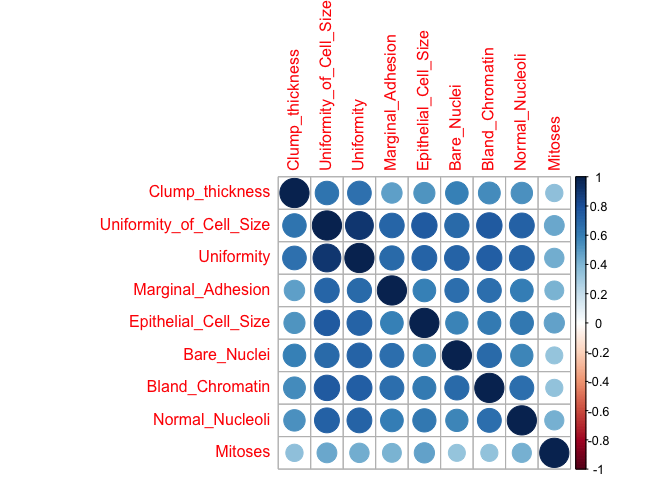
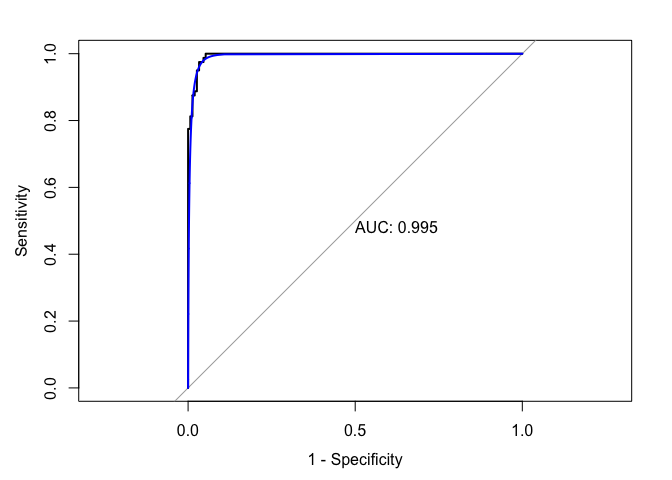
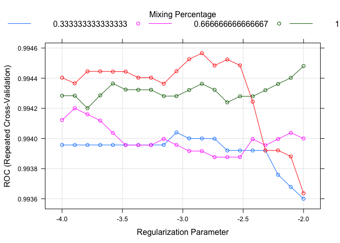
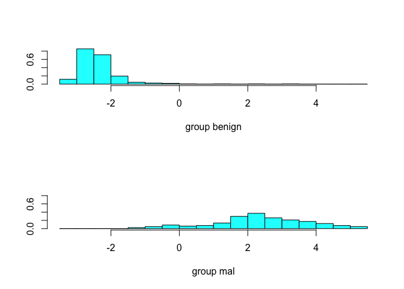
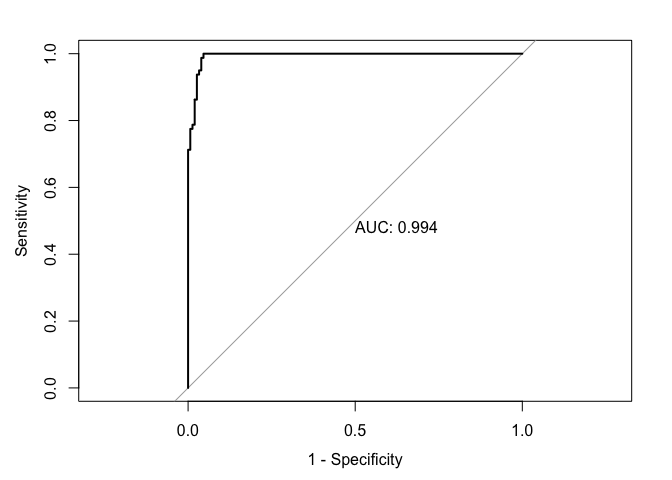
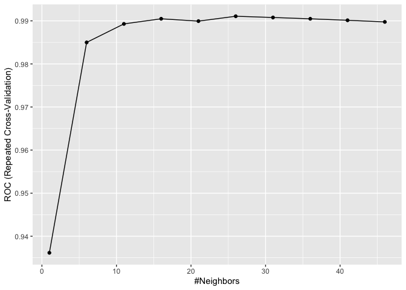
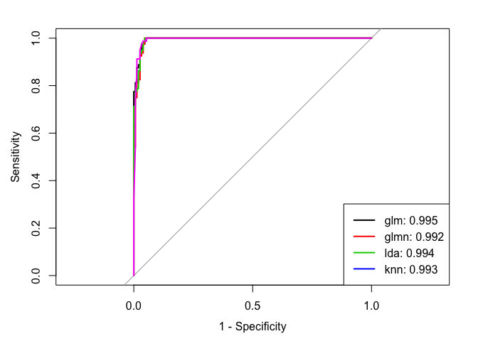

P8106\_Mtp
================
Ekta Chaudhary
26/03/2020

``` r
library(tidyverse)
library(readxl)
library(caret)
library(ModelMetrics)
library(glmnet)
library(gam)
library(mgcv)
library(splines)
library(pdp)
library(earth)
library(dplyr)
library(naniar)
library(bnstruct)
library(corrplot)
library(logisticPCA)
library(MASS)
library(e1071)
library(mlbench)
library(pROC)
library(AppliedPredictiveModeling)
```

Reading the Datasets

``` r
Diagnosis = 
read_csv('./data/Diagnosis.csv')
Prognosis = 
  read_csv('./data/Prognosis.csv')
Breast_Cancer = 
  read_csv(file = './data/Breast_Cancer.csv' ,col_names = c('id_number','Clump_thickness','Uniformity_of_Cell_Size','Uniformity','Marginal_Adhesion','Epithelial_Cell_Size','Bare_Nuclei','Bland_Chromatin','Normal_Nucleoli','Mitoses','Class_cancer')) 
```

``` r
Breast_Cancer = Breast_Cancer %>% replace_with_na_all(condition = ~.x == '?')
```

``` r
Breast_Cancer <- knn.impute(as.matrix(Breast_Cancer), k = 10, cat.var = 2:ncol(Breast_Cancer) - 2,
  to.impute = 1:nrow(Breast_Cancer), using = 1:nrow(Breast_Cancer))
```

``` r
Breast_Cancer <- data.frame(Breast_Cancer)
```

``` r
Breast_Cancer$Class_cancer = as.factor(ifelse(Breast_Cancer$Class_cancer == 4, 'mal','benign'))
Breast_Cancer = Breast_Cancer[,2:11]
```

``` r
x = model.matrix(Class_cancer~., Breast_Cancer) [,-1]

corrplot(cor(x))
```

<!-- -->

``` r
set.seed(1)
rowTrain <- createDataPartition(y = Breast_Cancer$Class_cancer,
                                p = 2/3,
                                list = FALSE)
```

``` r
glm.fit <- glm(Class_cancer~., 
               data = Breast_Cancer, 
               subset = rowTrain,
               family = binomial)

contrasts(Breast_Cancer$Class_cancer)
```

    ##        mal
    ## benign   0
    ## mal      1

``` r
test.pred.prob  <- predict(glm.fit, newdata = Breast_Cancer[-rowTrain,1:9],
                           type = "response")
test.pred <- rep("benign", length(test.pred.prob))
test.pred[test.pred.prob>0.5] <- "mal"

roc.glm <- roc(Breast_Cancer$Class_cancer[-rowTrain], test.pred.prob)
plot(roc.glm, legacy.axes = TRUE, print.auc = TRUE)
plot(smooth(roc.glm), col = 4, add = TRUE)
```

<!-- -->

``` r
ctrl <- trainControl(method = "repeatedcv",
                     repeats = 5,
                     summaryFunction = twoClassSummary,
                     classProbs = TRUE)
```

``` r
set.seed(1)
model.glm <- train(x = Breast_Cancer[rowTrain,1:9],
                  y = Breast_Cancer$Class_cancer[rowTrain],
                   method = "glm",
                   metric = "ROC",
                   trControl = ctrl)
```

``` r
coef(glm.fit)
```

    ##             (Intercept)         Clump_thickness Uniformity_of_Cell_Size 
    ##              -9.0107637               0.4221055               0.1457212 
    ##              Uniformity       Marginal_Adhesion    Epithelial_Cell_Size 
    ##               0.6370116               0.1479078              -0.2071035 
    ##             Bare_Nuclei         Bland_Chromatin         Normal_Nucleoli 
    ##               0.5172205               0.2023960               0.1863717 
    ##                 Mitoses 
    ##               0.6735681

``` r
glmnGrid <- expand.grid(.alpha = seq(0, 1, length = 4),
                        .lambda = exp(seq(-4, -2, length = 20)))


set.seed(1)
model.glmn <- train(x = Breast_Cancer[rowTrain,1:9],
                    y = Breast_Cancer$Class_cancer[rowTrain],
                    method = "glmnet",
                    tuneGrid = glmnGrid,
                    metric = "ROC",
                    trControl = ctrl)

plot(model.glmn, xTrans = function(x) log(x))   
```

<!-- -->

``` r
model.glmn$bestTune
```

    ##    alpha     lambda
    ## 72     1 0.05830279

``` r
test.pred.prob  <- predict(model.glmn, x = Breast_Cancer[-rowTrain,1:9],
                      method = "glmnet")
```

## Discriminant analysis

### LDA

We use the function `lda` in library `MASS` to conduct LDA.

``` r
library(MASS)

lda.fit <- lda(Class_cancer~., data = Breast_Cancer,
               subset = rowTrain)
plot(lda.fit)
```

<!-- -->

Evaluate the test set performance using ROC.

``` r
lda.pred <- predict(lda.fit, newdata = Breast_Cancer[-rowTrain,])
head(lda.pred$posterior)
```

    ##       benign          mal
    ## 3 0.99998228 1.772454e-05
    ## 4 0.00875467 9.912453e-01
    ## 5 0.99998862 1.137890e-05
    ## 7 0.81869551 1.813045e-01
    ## 8 0.99999630 3.695724e-06
    ## 9 0.99999902 9.816974e-07

``` r
roc.lda <- roc(Breast_Cancer$Class_cancer[-rowTrain], lda.pred$posterior[,2], 
               levels = c("benign", "mal"))

plot(roc.lda, legacy.axes = TRUE, print.auc = TRUE)
```

<!-- -->

Using caret:

``` r
set.seed(1)
model.lda <- train(x = Breast_Cancer[rowTrain,1:9],
                   y = Breast_Cancer$Class_cancer[rowTrain],
                   method = "lda",
                   metric = "ROC",
                   trControl = ctrl)
```

\#KNN

``` r
set.seed(1)
model.knn <- train(x = Breast_Cancer[rowTrain,1:9],
                   y = Breast_Cancer$Class_cancer[rowTrain],
                   method = "knn",
                   preProcess = c("center","scale"),
                   tuneGrid = data.frame(k = seq(1,50,by =5)),
                   trControl = ctrl)

ggplot(model.knn)
```

<!-- -->

GLM, Regularized GLM and LDA have relatively good performance.

``` r
res <- resamples(list(GLM = model.glm, GLMNET = model.glmn, 
                      LDA = model.lda, KNN = model.knn))
summary(res)
```

    ## 
    ## Call:
    ## summary.resamples(object = res)
    ## 
    ## Models: GLM, GLMNET, LDA, KNN 
    ## Number of resamples: 50 
    ## 
    ## ROC 
    ##             Min.   1st Qu.    Median      Mean 3rd Qu. Max. NA's
    ## GLM    0.9556452 0.9883233 0.9979503 0.9935506       1    1    0
    ## GLMNET 0.9576613 0.9917339 0.9979839 0.9945660       1    1    0
    ## LDA    0.9556452 0.9905637 0.9979839 0.9941979       1    1    0
    ## KNN    0.9506048 0.9881048 0.9964767 0.9910701       1    1    0
    ## 
    ## Sens 
    ##             Min.   1st Qu.   Median      Mean 3rd Qu. Max. NA's
    ## GLM    0.9333333 0.9666667 0.983871 0.9777419       1    1    0
    ## GLMNET 0.9354839 0.9677419 1.000000 0.9875699       1    1    0
    ## LDA    0.9333333 0.9677419 1.000000 0.9855914       1    1    0
    ## KNN    0.9333333 0.9666667 0.983871 0.9803656       1    1    0
    ## 
    ## Spec 
    ##          Min.   1st Qu.    Median      Mean   3rd Qu. Max. NA's
    ## GLM    0.8125 0.8750000 0.9375000 0.9363235 1.0000000    1    0
    ## GLMNET 0.6875 0.8235294 0.8750000 0.8942647 0.9375000    1    0
    ## LDA    0.6875 0.8750000 0.8786765 0.9003676 0.9375000    1    0
    ## KNN    0.7500 0.8750000 0.9375000 0.9188971 0.9852941    1    0

``` r
lda.pred <- predict(model.lda, newdata = Breast_Cancer[-rowTrain,], type = "prob")[,2]
glm.pred <- predict(model.glm, newdata = Breast_Cancer[-rowTrain,], type = "prob")[,2]
glmn.pred <- predict(model.glmn, newdata = Breast_Cancer[-rowTrain,], type = "prob")[,2]
knn.pred <- predict(model.knn, newdata = Breast_Cancer[-rowTrain,], type = "prob")[,2]


roc.lda <- roc(Breast_Cancer$Class_cancer[-rowTrain], lda.pred)
roc.glm <- roc(Breast_Cancer$Class_cancer[-rowTrain], glm.pred)
roc.glmn <- roc(Breast_Cancer$Class_cancer[-rowTrain], glmn.pred)
roc.knn <- roc(Breast_Cancer$Class_cancer[-rowTrain], knn.pred)

auc <- c(roc.glm$auc[1], roc.glmn$auc[1], roc.lda$auc[1], roc.knn$auc[1])

plot(roc.glm, legacy.axes = TRUE)
plot(roc.glmn, col = 2, add = TRUE)
plot(roc.lda, col = 3, add = TRUE)
plot(roc.knn, col = 6, add = TRUE)
modelNames <- c("glm","glmn","lda","knn")
legend("bottomright", legend = paste0(modelNames, ": ", round(auc,3)),
       col = 1:6, lwd = 2)
```

<!-- -->
